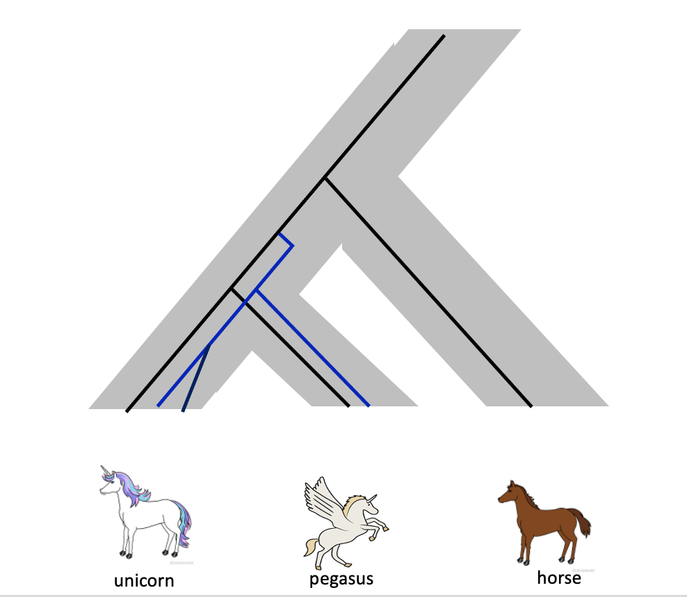

# 1. Comparative Genomics

**Q1** From each of the following Ensembl genome databases, choose **at least one species** per potal.


| Portal                                                  | Description                                                                                                                                     |
| ------------------------------------------------------- | ----------------------------------------------------------------------------------------------------------------------------------------------- |
| **[Ensembl (Vertebrates) 🐨](https://www.ensembl.org)** | Vertebrate animals, including mammals, birds, reptiles, amphibians, and fishes, with a strong focus on human and model species.                 |
| **[Ensembl Metazoa 🐝](https://metazoa.ensembl.org)**   | Animals (excluding vertebrates), such as insects, nematodes, crustaceans, and mollusks, including important model and pest species.             |
| **[Ensembl Protists 🧫](https://protists.ensembl.org)** | Protists, a diverse collection of mostly unicellular eukaryotes that are not animals, plants, or fungi, including algae and parasitic protozoa. |
| **[Ensembl Plants 🍋](https://plants.ensembl.org)**     | Land plants, ranging from model species to crops, including flowering plants, conifers, and mosses.                                             |
| **[Ensembl Fungi 🍄](https://fungi.ensembl.org)**       | Fungi, eukaryotic organisms that include yeasts, molds, and mushrooms, many of which play key ecological and industrial roles.                  |
| **[Ensembl Bacteria 🦠](https://bacteria.ensembl.org)** | Bacteria and Archaea, single-celled prokaryotic organisms found in virtually every environment, including many symbionts and pathogens.         |


**Q2** Provide a concise description (2–3 sentences) for each species explaining what kind of organism it is and any relevant biological or ecological context. 

**Q3** For each selected species, gather the following data:
   - Genome size
   - Chromosome number (For bacteria, usually their chromosome is one long,  molecule of double stranded DNA.)
   - Number of coding genes  
   
**Q4** Create a figure (e.g., bar chart, scatter plot, bubble chart) that visually compares the species across the gathered metrics. 

**Q5** Discuss the following reflective questions under the figure:
   - What trends do you observe in genome size relative to chromosome number or coding gene count?
   - Are there any  unexpected patterns among the selected species? What might explain them?


# 2. Gene duplication simulation

This exercise is mainly about understanding and interpreting gene sequences and phylogenetic trees, rather than focusing on running the script itself. If you happen to run into technical problems or error messages that are difficult to solve, please don’t worry, simply switch to the provided datasets and continue the discussion from there.

If you are interested, you may read the comments in the script, where the purpose of each part is explained.


In this practical, we will simulate DNA sequences under a simple evolutionary model. 
We will introduce **gene duplication**, **speciation**, and **mutation accumulation**, 
and then observe how these events are reflected in DNA alignments, distance matrices, and phylogenetic trees.

We use three species:
- **Unicorn**
- **Pegasus**
- **Horse (outgroup)**


{width=50%}


 ============================================================
 Gene-family simulation 
 Time unit: Myr (million years)
 Tips produced:
   Horse_gene1
   Unicorn_gene1a, Unicorn_gene1b
   Pegasus_gene1a, Pegasus_gene1b, Pegasus_gene1c
 Outputs: FASTA, p-distance (TSV), NJ tree (Newick), PDF plot
 ============================================================


```{r,eval=FALSE}

set.seed(42) # Change the number to your group number if you like

## ---------------- 1) Branch lengths (Myr) -------------------
## All time parameters unified here
bl <- list(
  a = 0.25,  # terminal branches after Unicorn–Pegasus speciation
  b = 0.15,  # from duplication node to Unicorn/Pegasus split
  c = 0.45,  # from Unicorn/Pegasus ancestor to Horse lineage
  d = 0.10,  # from root to (duplication + Horse) ancestor
  e = 0.10   # recent duplication on Pegasus gene1b lineage (e.g., 0.10 Myr)
)

## ---------------- 2) Substitution model ---------------------
mu_per_Myr <- 0.8                # JC69 rate per site per Myr
base_freq  <- c(A=.25,C=.25,G=.25,T=.25)
L          <- 1000               # sequence length (bp)

## Optional losses at tips (TRUE = drop)
loss <- c(
  Horse_gene1      = FALSE,
  Unicorn_gene1a   = FALSE,
  Unicorn_gene1b   = FALSE,
  Pegasus_gene1a   = FALSE,
  Pegasus_gene1b   = FALSE,
  Pegasus_gene1c   = FALSE
)

## ---------------- 3) Output files ---------------------------
fasta_file        <- "sim_gene_family.fasta"
dist_file         <- "sim_p_distance.tsv"
tree_file         <- "sim_tree_nj.nwk"
species_tree_file <- "species_tree_example.nwk"
plot_file         <- "sim_tree_plot.pdf"

cat("=== Parameters (Myr) ===\n")
cat(sprintf("a=%.2f b=%.2f c=%.2f d=%.2f e=%.2f  |  mu_per_Myr=%.3f  L=%d\n\n",
            bl$a, bl$b, bl$c, bl$d, bl$e, mu_per_Myr, L))

## ---------------- 4) Topology (biology ↔ tree) ---------------
## Ancient duplication splits the gene family into two lineages:
##   gene1a lineage (left):  Unicorn_gene1a, Pegasus_gene1a
##   gene1b lineage (right): Unicorn_gene1b, Pegasus_gene1b
## Horse has a single copy and attaches on the right clade.
## Recent Pegasus-specific duplication occurs only on the Pegasus gene1b branch:
##   Pegasus_gene1b  ->  Pegasus_gene1b + Pegasus_gene1c  (time = bl$e)

make_tip  <- function(label) list(label=label, children=NULL, bl=NULL)
make_node <- function(left, right, bl_left, bl_right, name=NULL) {
  list(label=name, children=list(left, right), bl=c(bl_left, bl_right))
}

# Tips
H1  <- make_tip("Horse_gene1")
Ua  <- make_tip("Unicorn_gene1a")
Ub  <- make_tip("Unicorn_gene1b")
Pa  <- make_tip("Pegasus_gene1a")
Pb  <- make_tip("Pegasus_gene1b")
Pc  <- make_tip("Pegasus_gene1c")

# Recent Pegasus duplication occurs on the Pegasus-side of gene1b
# Split Pegasus gene1b terminal branch: (a - e) to the recent-dup node, then e to each daughter
stopifnot(bl$a >= bl$e)
peg_b_pre  <- bl$a - bl$e
peg_b_post <- bl$e

peg_b_recent <- make_node(Pb, Pc, peg_b_post, peg_b_post, "Pegasus_recent_dup_b")

# Ancient duplication → left (gene1a lineage) and right (gene1b + Horse)
# gene1a lineage: Unicorn_gene1a and Pegasus_gene1a, each with terminal a
dup_left_gene1a  <- make_node(Ua, Pa, bl$a, bl$a, "dup_left_gene1a")

# gene1b lineage: Unicorn_gene1b with terminal a, Pegasus gene1b branch split as above
dup_right_gene1b <- make_node(Ub, peg_b_recent, bl$a, peg_b_pre, "dup_right_gene1b")

# Attach Horse to the right side (gene1b + Horse)
right_inner <- make_node(dup_right_gene1b, H1, bl$b, bl$c, "right_with_horse")

# Root splits into (gene1a lineage) and ((gene1b lineage) + Horse)
root <- make_node(dup_left_gene1a, right_inner, bl$b, bl$d, "root")

# Species tree for lectures (not used to simulate sequences)
# U–P split at 0.25; Horse split at 0.45; internal = 0.20
species_tree_newick <- "((Unicorn:0.25,Pegasus:0.25):0.20,Horse:0.45);"

## ---------------- 5) JC69 utilities -------------------------
bases <- c("A","C","G","T")
b2i   <- setNames(1:4, bases)
i2b   <- setNames(bases, 1:4)

P_JC69 <- function(t_Myr, mu_per_Myr) {
  e <- exp(-4 * mu_per_Myr * t_Myr / 3)
  p_same <- 1/4 + 3/4 * e
  p_diff <- 1/4 - 1/4 * e
  M <- matrix(p_diff, 4, 4); diag(M) <- p_same; M
}

root_seq <- function(L, freq) sample(bases, size=L, replace=TRUE, prob=freq)

# Substitutions occur here (JC69)
mutate_branch <- function(parent_seq, t_Myr, mu_per_Myr) {
  if (t_Myr <= 0) return(parent_seq)
  M <- P_JC69(t_Myr, mu_per_Myr)
  pidx <- b2i[parent_seq]
  out  <- parent_seq
  for (k in 1:4) {
    idx_k <- which(pidx == k); if (!length(idx_k)) next
    cum <- cumsum(M[k, ])
    draws  <- runif(length(idx_k))
    to_idx <- findInterval(draws, cum) + 1
    out[idx_k] <- i2b[to_idx]
  }
  out
}
```


```{r,eval=FALSE}

## ---------------- 6) Simulate sequences ---------------------
simulate_sequences <- function(tree, L, mu_per_Myr, base_freq) {
  anc <- root_seq(L, base_freq)
  leaves <- list()
  rec <- function(node, parent_seq) {
    if (is.null(node$children)) { leaves[[node$label]] <<- parent_seq; return() }
    left  <- mutate_branch(parent_seq, node$bl[1], mu_per_Myr)
    right <- mutate_branch(parent_seq, node$bl[2], mu_per_Myr)
    rec(node$children[[1]], left)
    rec(node$children[[2]], right)
  }
  rec(tree, anc)
  leaves
}

write_fasta <- function(seq_list, file) {
  con <- file(file, open="w"); on.exit(close(con))
  for (nm in names(seq_list)) {
    cat(">", nm, "\n", sep="", file=con)
    s <- paste(seq_list[[nm]], collapse="")
    s80 <- substring(s, seq(1, nchar(s), 80), pmin(seq(80, nchar(s), 80), nchar(s)))
    writeLines(s80, con=con)
  }
}

## ---------------- 7) Run & Outputs --------------------------
seqs <- simulate_sequences(root, L=L, mu_per_Myr=mu_per_Myr, base_freq=base_freq)


# Sanity: only A/C/G/T
stopifnot(all(unlist(seqs) %in% bases))

write_fasta(seqs, fasta_file)
cat(sprintf("FASTA written: %s (n=%d, L=%d)\n", fasta_file, length(seqs), L))


```


```{r,eval=FALSE}
# Save species tree for slides
cat(species_tree_newick, file=species_tree_file)
cat(sprintf("Species tree example written: %s\n", species_tree_file))

## ---------------- 8) Distances & NJ tree --------------------
labs <- names(seqs); n <- length(seqs)
M <- matrix(0, n, n, dimnames=list(labs, labs))
for (i in 1:(n-1)) for (j in (i+1):n) {
  M[i, j] <- M[j, i] <- mean(seqs[[i]] != seqs[[j]])
}
write.table(round(M, 6), file=dist_file, sep="\t", quote=FALSE, col.names=NA)
cat(sprintf("Pairwise p-distance written: %s\n", dist_file))

if (!requireNamespace("ape", quietly=TRUE)) {
  install.packages("ape", repos="https://cloud.r-project.org")
}
library(ape)
D  <- as.dist(M)
tr <- nj(D)
write.tree(tr, file=tree_file)
cat(sprintf("NJ tree (Newick) written: %s\n", tree_file))

## ---------------- 9) Publication-style plot -----------------
tipcols <- rep("black", length(tr$tip.label)); names(tipcols) <- tr$tip.label
tipcols[grep("Unicorn", tr$tip.label)] <- "darkgreen"
tipcols[grep("Pegasus", tr$tip.label)] <- "steelblue"
tipcols[grep("Horse",   tr$tip.label)] <- "grey20"

pdf(plot_file, width=7.5, height=5.5)
par(mar=c(2.5, 1, 3, 1))
plot(tr,
     type="cladogram",
     use.edge.length=TRUE,
     tip.color=tipcols,
     cex=1.2,
     font=2,
     main="NJ tree of a gene family: ancient dup + Pegasus recent dup",
     sub="Pegasus gene1b → (gene1b, gene1c) at time e")
add.scale.bar(length=0.05, lwd=2)
legend("bottomleft",
       legend=c("Unicorn","Pegasus","Horse"),
       col=c("darkgreen","steelblue","grey20"),
       pch=19, bty="n", cex=1.0)
dev.off()
cat(sprintf("Tree plot saved: %s\n", plot_file))

cat("Done.\n")
```


## Assignment Tasks

**Q1** Open the sim_tree_plot.pdf and discuss the gene evolution history.

Add the labels gene1a, gene1b, etc. to the given tree diagram (png.file), according to the scenario (Which tip corresponds to which gene?). 

{width=50%}


**Q2** On the sim_tree_plot.pdf, show where gene duplication events occurred and where speciation events occurred.

**Q3** For the gene copies in the tree, indicate which pairs are paralogs, which are orthologs, and which are simply homologs.


**Q4** Visualise the FASTA alignment (sim_gene_family.fasta) at (https://alignmentviewer.org/), identify and illustrate a few examples of sites, such as:

 - Conserved sites: positions where all sequences share the same nucleotide.

 - Variable sites: positions where sequences differ, without a clear species- or lineage-specific pattern.

 - Lineage-specific substitutions: positions where a change is unique to one species or one gene copy.

Highlight these sites in the alignment screenshot and explain what they might tell us about evolutionary history.


**Q5** Write a short discussion reflecting on the results. For example, but not limited to:

 - How do duplication and speciation events shape the gene tree?

 - What can we infer from the alignment about evolutionary relationships?

 - Were there any surprising observations?

