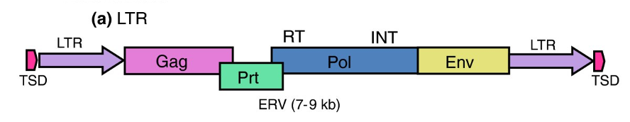
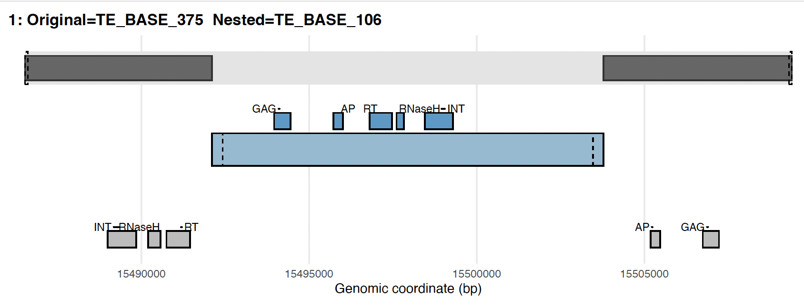
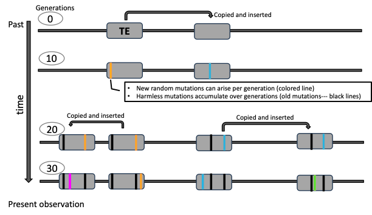
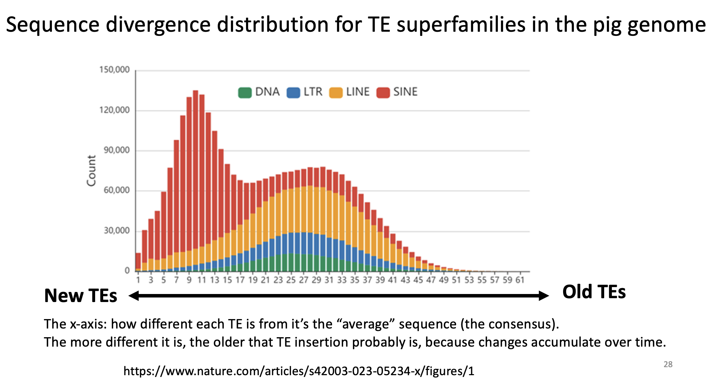

Each group is expected to submit a written report of about 2–3 pages in Word format.

Please also include a short statement on the contributions of each group member.


# Nested TE - TE in another TE 

{width=80%}

RT (Reverse Transcriptase): Converts RNA back into DNA. 
IN (Integrase): Cuts the host DNA and joins the TE DNA to it.
EN (Endonuclease): Makes a nick (cut) in the host DNA, providing an entry site for the TE.


[Atha_nestOrigPairsFinal.gff](Atha_nestOrigPairsFinal.gff)


The file is in GFF (General Feature Format), a standard format to describe genomic features.

Each row is one annotated feature (e.g., a repeat element, a conserved protein domain).

| Column     | Meaning                                                                 |
|------------|--------------------------------------------------------------------------|
| seqid      | The sequence (chromosome, scaffold, or contig) where the feature is found |
| source     | The program or annotation source                                         |
| type       | The feature type (e.g., nested_repeat, polypeptide_conserved_region)     |
| start      | Start position of the feature (1-based)                                  |
| end        | End position of the feature                                              |
| score      | A numeric score (often “.” if not used)                                  |
| strand     | Which DNA strand (+ or -)                                                |
| phase      | Reading frame information for CDS features (often “.” here)              |
| attributes | Additional details (ID, Parent, name, annotation, etc.)                  |


| Type                         | Example attributes                                                                 |
|------------------------------|-------------------------------------------------------------------------------------|
| nested_repeat                | `ID=TE_BASE_106; name=TE_BASE_106; annotation=Class_I`                             |
| polypeptide_conserved_region | `ID=DOMAIN 106-2; Parent=TE_BASE_106; name=RT (reverse transcriptase domain)`      |
| polypeptide_conserved_region | `ID=DOMAIN 106-3; Parent=TE_BASE_106; name=RNaseH`                                 |
| polypeptide_conserved_region | `ID=DOMAIN 106-4; Parent=TE_BASE_106; name=INT (integrase domain)`                 |
| polypeptide                  | A longer protein-coding feature related to the TE                                  |


How to read the file in context

nested_repeat marks the main TE insertion (e.g., an LTR retrotransposon).

Inside it, several conserved protein domains are annotated.

The annotation field shows TE classification (for example, Class I → LTR → Ty3/gypsy → Athila).

The Parent attribute links each conserved domain back to its TE.


<details>
<summary>Show R script</summary>

```{r,eval=FALSE}
suppressPackageStartupMessages({
  library(readr)
  library(dplyr)
  library(stringr)
  library(ggplot2)
  library(tidyr)
  library(ggrepel)
})


#--- Read a GFF file and expand the attributes column
read_te_gff <- function(path) {
  cols <- c("seqid","source","type","start","end","score","strand","phase","attributes")
  gff <- readr::read_tsv(
    path,
    comment = "#",
    col_names = cols,
    col_types = cols(
      seqid = col_character(),
      source = col_character(),
      type = col_character(),
      start = col_integer(),
      end   = col_integer(),
      score = col_character(),
      strand= col_character(),
      phase = col_character(),
      attributes = col_character()
    )
  )

  # Expand attributes given as key=value pairs separated by ';'
  attr_df <- gff$attributes %>%
    str_split_fixed(";", n = 50) %>%   # a practical upper bound
    as.data.frame(stringsAsFactors = FALSE)

  parse_attr_cols <- function(x) {
    kv <- str_split_fixed(x, "=", 2)
    tibble(key = kv[,1], val = kv[,2]) %>%
      filter(key != "", !is.na(val)) %>%
      distinct(key, .keep_all = TRUE) %>% # keep first occurrence for duplicated keys
      pivot_wider(names_from = key, values_from = val)
  }

  parsed <- lapply(seq_len(nrow(attr_df)), function(i) {
    parse_attr_cols(as.character(unlist(attr_df[i, ])))
  })

  # Bind rows, missing keys become NA
  
  parsed_attr <- bind_rows(parsed)

  out <- bind_cols(gff %>% select(-attributes), parsed_attr) %>%
    mutate(
      ID       = coalesce(ID, name),
      position = coalesce(position, ""),
      role     = case_when(
        position == "original" ~ "TE_original",
        position == "nested"   ~ "TE_nested",
        TRUE ~ NA_character_
      )
    )
  out
}

gff <- read_te_gff("Atha_nestOrigPairsFinal.gff")

#--- Draw a schematic for a specified Original/Nested TE pair
plot_te_nesting <- function(gff_tbl, original_id, nested_id, pad_bp = 500) {
  # Pick the first feature by start if multiple match the ID/name
  ori <- gff_tbl %>% filter(ID == original_id | name == original_id) %>% slice_min(start, n = 1)
  nes <- gff_tbl %>% filter(ID == nested_id   | name == nested_id)   %>% slice_min(start, n = 1)

  if (nrow(ori) == 0) stop("Original ID not found: ", original_id)
  if (nrow(nes) == 0) stop("Nested ID not found: ", nested_id)
  if (ori$seqid[1] != nes$seqid[1]) {
    warning("Original and Nested are on different contigs. The plot will still be drawn, but please verify the data.")
  }

  chr   <- ori$seqid[1]
  x_min <- min(ori$start, nes$start) - pad_bp
  x_max <- max(ori$end,   nes$end)   + pad_bp

  # Layers
  # Original fragmented segments
  frag_ori <- gff_tbl %>%
    filter(Parent %in% c(original_id), type == "repeat_fragment")

  # Original LTRs
  ltr_ori <- gff_tbl %>%
    filter(Parent %in% c(original_id), type == "long_terminal_repeat")

  # Nested body (rectangle)
  body_nes <- tibble(
    start = nes$start, end = nes$end, label = nested_id
  )

  # Nested LTRs
  ltr_nes <- gff_tbl %>%
    filter(Parent %in% c(nested_id), type == "long_terminal_repeat")

  # Domains for Original/Nested
  dom_ori <- gff_tbl %>%
    filter(Parent %in% c(original_id), type == "polypeptide_conserved_region") %>%
    mutate(label = coalesce(name, ""),
           xlab = (start + end)/2,
           ylab = 1.05)

  dom_nes <- gff_tbl %>%
    filter(Parent %in% c(nested_id), type == "polypeptide_conserved_region") %>%
    mutate(label = coalesce(name, ""),
           xlab = (start + end)/2,
           ylab = 2.5)

  # Track assignments on y-axis
  # y=3: Original overall band (light gray) and fragments (dark gray)
  # y=2: Nested body/LTRs/domains
  # y=1: Original domains (separate row to avoid overlap)
  base_ori <- tibble(start = ori$start, end = ori$end, y = 3, what = "Original")
  # Note: a 'base_nes' object would be unused here and is intentionally omitted.

  # Reproducible repel placement
  set.seed(1234)

  p <- ggplot() +
    # Original overall background
    geom_rect(
      data = base_ori,
      aes(xmin = start, xmax = end, ymin = 2.8, ymax = 3.2),
      fill = "grey90", color = NA
    ) +
    # Original fragments
    geom_rect(
      data = frag_ori,
      aes(xmin = start, xmax = end, ymin = 2.85, ymax = 3.15),
      fill = "grey40", color = "grey20"
    ) +
    # Original LTRs
    geom_rect(
      data = ltr_ori,
      aes(xmin = start, xmax = end, ymin = 2.8, ymax = 3.2),
      fill = NA, color = "black", linetype = 2, linewidth = 0.4
    ) +

    # Nested body
    geom_rect(
      data = body_nes,
      aes(xmin = start, xmax = end, ymin = 1.8, ymax = 2.2),
      fill = "#8FBCD4", color = "black"
    ) +
    # Nested LTRs
    geom_rect(
      data = ltr_nes,
      aes(xmin = start, xmax = end, ymin = 1.8, ymax = 2.2),
      fill = NA, color = "black", linetype = 2, linewidth = 0.4
    ) +

    # Nested domains (upper row)
    geom_rect(
      data = dom_nes,
      aes(xmin = start, xmax = end, ymin = 2.25, ymax = 2.45),
      fill = "#4C9ACB", color = "black"
    ) +
    ggrepel::geom_text_repel(
      data = dom_nes,
      aes(x = xlab, y = ylab, label = label),
      direction = "x",              # avoid overlaps horizontally, keep y fixed
      min.segment.length = 0,
      box.padding = 0.2,
      point.padding = 0.1,
      max.overlaps = Inf,
      size = 3
    ) +

    # Original domains (lower row)
    geom_rect(
      data = dom_ori,
      aes(xmin = start, xmax = end, ymin = 0.8, ymax = 1.0),
      fill = "#BDBDBD", color = "black"
    ) +
    ggrepel::geom_text_repel(
      data = dom_ori,
      aes(x = xlab, y = ylab, label = label),
      direction = "x",
      min.segment.length = 0,
      box.padding = 0.2,
      point.padding = 0.1,
      max.overlaps = Inf,
      size = 3
    ) +

    coord_cartesian(xlim = c(x_min, x_max), ylim = c(0.6, 3.4), expand = FALSE, clip = "off") +
    labs(
      title = paste0(chr, ": Original=", original_id, "  Nested=", nested_id),
      x = "Genomic coordinate (bp)",
      y = NULL
    ) +
    theme_minimal(base_size = 11) +
    theme(
      panel.grid.major.y = element_blank(),
      panel.grid.minor   = element_blank(),
      axis.text.y        = element_blank(),
      plot.title         = element_text(face = "bold"),
      plot.margin        = margin(t = 10, r = 30, b = 10, l = 30)
    )

  return(p)
}

#--- Helper to save the plot
save_te_plot <- function(p, file = "te_nesting_schematic.pdf", width = 10, height = 3.5) {
  ggsave(file, p, width = width, height = height, units = "in")
}

# Example usage
p <- plot_te_nesting(gff, original_id = "TE_BASE_375", nested_id = "TE_BASE_106")
print(p)
save_te_plot(p, "Atha_TE375_with_TE106.pdf")


```

</details> 


| Schematic part                   | Function                                      | Example GFF annotation (e.g., TE\_BASE\_106) |
| -------------------------------- | --------------------------------------------- | -------------------------------------------- |
| **Gag**                          | Structural protein, particle formation        | `polypeptide_conserved_region … name=GAG`    |
| **Protease (Prt)**               | Cleaves polyprotein into functional enzymes   | `name=AP` (Aspartyl protease)                |
| **Pol** (polyprotein)            | Encodes enzymatic domains (RT, RNaseH, INT)   | Split into multiple GFF records              |
| – **RT (Reverse Transcriptase)** | Converts RNA into DNA                         | `name=RT`                                    |
| – **RNaseH**                     | Cleaves RNA in RNA–DNA hybrids                | `name=RNaseH`                                |
| – **INT (Integrase)**            | Inserts TE DNA into host genome               | `name=INT`                                   |
| **Env** (only in some ERVs)      | Envelope glycoprotein, mediates infectivity   | Absent in most plant LTR-TEs → not annotated |
| **LTR (5′ / 3′)**                | Terminal repeats, promoters for transcription | `long_terminal_repeat … name=ltr left/right` |
| **PPT (Polypurine Tract)**       | Primer site for reverse transcription         | `RR_tract … name=ppt`                        |


The figure you see (**Atha_TE375_with_TE106.pdf**) represents two transposable elements (TEs), one original element (TE_BASE_375) and one nested element (TE_BASE_106). 

{width=80%}

Their structural features are annotated in the GFF file provided (**Atha_nestOrigPairsFinal.gff**). Use the figure and the annotation information together to answer the following questions. Write your answers in complete sentences.


**Q1** Describe the overall organization of TE_BASE_375 (the original element). Include the presence and approximate location of LTRs, TSRs, and protein-coding domains (GAG, AP, RT, RNaseH, INT).

**Q2**. Describe the structure of TE_BASE_106 (the nested element). Indicate its major domains and the position of its LTRs and PPT relative to the element.

**Q3**. Explain in your own words how TE_BASE_106 is inserted within TE_BASE_375. Which part of the original element does it interrupt?


# Mutation accumulation patterns over time
{width=80%}


**At generation 0**, a transposable element (TE) inserts into the genome, producing identical copies with no sequence differences. This represents the ancestral state before mutations have accumulated. 

**By generation 10**, new random mutations appear in individual copies. These are shown as colored marks, while mutations from earlier generations are shown in black to indicate that they have persisted over time. 

Each copy therefore begins to accumulate distinguishing features, but they still retain most of their ancestral sequence.

**By generation 20**, some copies share the same set of black marks at the same location, reflecting mutations inherited from a common ancestor. 
At the same time, new colored marks continue to arise independently in different copies, adding additional diversity. 

The accumulation of both shared, older mutations and unique, recent mutations means that the copies can now be grouped into clades: lineages that share an early history but have since diverged further.

**By generation 30**, which corresponds to our **present-day observation**, all TE copies still show the same overall structure, but each copy carries a different combination of old and new mutations. 

Some mutations are common to several copies, marking older events, while others are unique to individual copies, representing more recent changes. The result is that present-day copies are no longer identical but dispersed around an “average” sequence.


**Q4.** Inheritance of mutations

Follow the copy that carries the orange mutation introduced at generation 10.

Question: How can you tell from the figure that the orange mutation at generation 10 did not disappear but was transmitted to descendants in later generations?

<details>
<summary> **Hint** </summary>
Hint 1: In the figure, colored lines represent new mutations that arise in a specific generation.

Hint 2: Once a mutation has appeared, in later generations it is drawn as a black line to indicate it has become part of the “background” set of inherited mutations.

Hint 3: Look at the descendants of the copy with the orange line — do they still show a vertical line at the same position?
</details>


**Q5.**  Compare the copy born at generation 10 with the copy born at generation 30.

Which copy (generation 10 vs. generation 30) carries more black lines, and what does that difference tell you about their relative sequence divergence from the original TE?


<details>
<summary>**Hint**</summary>
Hint 1: Each black line corresponds to a mutation that arose earlier and has been passed down.

Hint 2: A copy that was born earlier has had more time to accumulate additional mutations over successive generations.

Hint 3: Count visually how many black lines each of the two copies shows.
</details>


**Q6.** 
At the present observation, several copies display the same pattern of black lines. What does the sharing of identical black lines among present-day copies indicate about their ancestry and genealogical relationships?

<details>
<summary>**Hint**</summary>
Hint 1: If two copies share the same black lines, this means they both inherited those mutations from a common ancestor.

Hint 2: Think of the black lines as “signatures” of ancestry — copies with the same signature must come from the same lineage.

Hint 3: In contrast, copies with different sets of black lines must have diverged earlier or come from different ancestors.

</details>


## For  the practical session...

This **average sequence** is referred to as the consensus, which is built by aligning all copies and taking the most frequent nucleotide at each position. 

Because the consensus reflects the most common and thus most conserved state, it approximates the ancestral sequence. 

The divergence of each copy from the consensus, measured as the fraction of positions where its sequence differs, provides a relative indicator of age.

Copies that are very similar to the consensus are likely to be more recent, while those that differ more strongly are probably older, having had more time to accumulate mutations. 


{width=80%}

The x-axis shows how different each TE copy is from its “average” sequence, called the consensus.

Copies that are very similar to the consensus (on the left side) are considered recent insertions, because not much time has passed for mutations to accumulate.

Copies that are more different from the consensus (toward the right) are interpreted as older insertions, since mutations build up gradually over evolutionary time.

A peak in the histogram therefore represents a wave of transposition activity: many copies created at about the same time, which now share a similar level of divergence from the consensus.


# TE generation and mutation simulation

In this exercise, we simulate the proliferation and mutation of transposable element (TE) copies over evolutionary time. Each copy is represented as a short DNA sequence that can mutate at every generation. New copies are introduced at specified time points (bursts), and all sequences accumulate substitutions with a fixed mutation rate.


Each copy is annotated with its birth generation and its age (the number of generations since its birth). The divergence from the consensus is measured by the Hamming distance (the count of base differences). Histograms show the distribution of divergence, colored by age.

By exploring different parameter scenarios (e.g., late bursts versus constant bursts - or more if you like), we can visualize how the age of copies relates to their sequence divergence. 


<details>
<summary>Show R script</summary>

```{r, eval=FALSE}

# =========================================
# TE copy birth/mutation simulation (no MSA)
#   - Outputs: FASTA, summary TSV, histogram PNG
# =========================================
suppressPackageStartupMessages({
  library(tidyverse)
  library(viridis)
})

# ---------- Utilities ----------
rand_seq <- function(n){
  paste(sample(c("A","C","G","T"), n, replace = TRUE), collapse = "")
}
mutate_seq_once <- function(seq, p){
  if (p <= 0) return(seq)
  v <- strsplit(seq, "", fixed = TRUE)[[1]]
  m <- rbinom(length(v), 1, p) == 1
  if (any(m)){
    choices <- c("A","C","G","T")
    v[m] <- vapply(v[m], function(b) sample(setdiff(choices, b), 1), character(1))
  }
  paste(v, collapse = "")
}
hamming <- function(a, b){
  va <- strsplit(a, "", fixed = TRUE)[[1]]
  vb <- strsplit(b, "", fixed = TRUE)[[1]]
  stopifnot(length(va) == length(vb))
  sum(va != vb)
}
write_fasta <- function(names, seqs, file){
  stopifnot(length(names) == length(seqs))
  con <- file(file, open = "w", encoding = "UTF-8")
  on.exit(close(con))
  for (i in seq_along(names)){
    writeLines(paste0(">", names[i]), con = con)
    writeLines(seqs[i], con = con)
  }
  invisible(file)
}

# ---------- Core simulation ----------
run_simulation <- function(L = 100, G = 100, mu = 0.0005,
                           copy_plan = tibble(gen = c(0, 80), add = c(20, 20)),
                           seed = 1,
                           out_prefix = "scenario"){
  set.seed(seed)

  copies <- tibble(id = character(), birth = integer(), seq = character())

  # generation 0
if (0 %in% copy_plan$gen){
  k0 <- copy_plan$add[match(0, copy_plan$gen)]
  founder <- rand_seq(L)                        # single ancestral sequence
  for (i in seq_len(k0)){
    copies <- add_row(copies,
                      id = paste0("C", nrow(copies)+1),
                      birth = 0,
                      seq = founder)            # all identical at gen=0
  }
}
  # generations 1..G
  for (g in 1:G){
    if (g %in% copy_plan$gen){
      k <- copy_plan$add[match(g, copy_plan$gen)]
      for (i in seq_len(k)){
        parent <- sample(copies$id, 1)
        s <- copies$seq[copies$id == parent]
        copies <- add_row(copies,
                          id = paste0("C", nrow(copies) + 1),
                          birth = g,
                          seq = s)
      }
    }
    copies$seq <- vapply(copies$seq, mutate_seq_once, character(1), p = mu)
  }

  # consensus and distances

youngest_birth <- max(copies$birth)            
idx_young      <- which(copies$birth == youngest_birth)


Myoung <- do.call(rbind, strsplit(copies$seq[idx_young], "", fixed = TRUE))
cons   <- apply(Myoung, 2, function(col) names(which.max(table(col)))) |>
  paste0(collapse = "")

diff_count <- vapply(copies$seq, hamming, integer(1), b = cons)

  diff_count <- vapply(copies$seq, hamming, integer(1), b = cons)

  copies <- copies %>%
    mutate(age = G - birth,
           name = sprintf("TE_g%d_age%d_%s", birth, age, id))

  div_df <- copies %>% transmute(name, id, birth, age, diff = diff_count) %>%
    mutate(age = factor(age, levels = sort(unique(age))))

  # outputs
  dir.create("outputs", showWarnings = FALSE)

  fasta_file <- file.path("outputs", paste0(out_prefix, "_copies.fasta"))
  write_fasta(c("CONSENSUS", div_df$name), c(cons, copies$seq), fasta_file)

  tsv_file <- file.path("outputs", paste0(out_prefix, "_summary.tsv"))
  div_df %>% arrange(as.integer(as.character(age)), diff) %>% write_tsv(tsv_file)

  p_stack_count <- ggplot(div_df, aes(x = diff, fill = age)) +
    geom_histogram(bins = 25, position = "stack", color = "grey15", linewidth = 0.2) +
    scale_fill_viridis_d(option = "magma", end = 0.95, name = "Age (generations)") +
    labs(x = "Differences to consensus (Hamming count)", y = "Copies",
         title = sprintf("Divergence by age — %s", out_prefix)) +
    theme_bw(base_size = 12) +
    theme(panel.grid.minor = element_blank())

  png_file <- file.path("outputs", paste0(out_prefix, "_hist_stack.png"))
  ggsave(png_file, p_stack_count, width = 7, height = 4.5, dpi = 300)

  list(
    params = list(L = L, G = G, mu = mu, copy_plan = copy_plan),
    N = nrow(copies),
    consensus = cons,
    files = list(
      fasta = fasta_file,
      summary_tsv = tsv_file,
      histogram_png = png_file
    ),
    data = div_df,
    plot = p_stack_count
  )
}


# ------------- Parameter sets (two scenarios) -------------
# Scenario A: shorter genome, late burst,
# ---------- Two parameter scenarios ----------
params_A <- list(
  L = 500, G = 1000, mu = 0.001,
  copy_plan = tibble(gen = c(0, 250,500, 750), add = c(10,10,10,70)),
  seed = 2, out_prefix = "scenario_A_lateBurst"
)
params_B <- list(
  L = 500, G = 1000, mu = 0.001,
  copy_plan = tibble(gen = c(0, 250,500,750), add = c(25,25, 25, 25)),
  seed = 2, out_prefix = "scenario_B_constant"
)
# ------------- Run both scenarios -------------
resA <- do.call(run_simulation, params_A)
resB <- do.call(run_simulation, params_B)

# Print quick summaries to console
message("Scenario A — files:")
print(resA$files)
message("Scenario B — files:")
print(resB$files)

# Show plots if running interactively
print(resA$plot)
print(resB$plot)

```
</details> 


In case you need output files...

[scenario_A.tsv](scenario_A_lateBurst_summary.tsv)

[scenario_B.tsv](scenario_B_constant_summary.tsv)

**Q7**. Using the TSV file, plot the divergence (Hamming count) against copy age as a boxplot. Discuss the result.


<details>
<summary>Show R script</summary>
```{r, eval=FALSE}

suppressPackageStartupMessages({
  library(tidyverse); library(viridis); library(readr)
})

# Edit paths if needed
file_A <- "outputs/scenario_A_lateBurst_summary.tsv"
file_B <- "outputs/scenario_B_constant_summary.tsv"

dfA <- read_tsv(file_A, show_col_types = FALSE) %>% mutate(scenario = "Late burst")
dfB <- read_tsv(file_B, show_col_types = FALSE) %>% mutate(scenario = "Constant")

all_df <- bind_rows(dfA, dfB) %>%
  mutate(
    age = as.integer(as.character(age))
  )

# Unify age levels across scenarios
age_levels <- sort(unique(all_df$age))
all_df <- all_df %>%
  mutate(age_f = factor(age, levels = age_levels),
         scenario = factor(scenario, levels = c("Late burst", "Constant")))

# Boxplots side by side, identical colors for identical ages
p_box2 <- ggplot(all_df, aes(x = age_f, y = diff, fill = age_f)) +
  geom_boxplot(outlier.shape = NA, alpha = 0.9) +
  geom_jitter(aes(color = age_f), width = 0.15, height = 0, alpha = 0.5, size = 1) +
  scale_fill_viridis_d(option = "magma", end = 0.95, name = "Age (generations)", drop = FALSE) +
  scale_color_viridis_d(option = "magma", end = 0.95, guide = "none", drop = FALSE) +
  labs(x = "Age (generations)", y = "Differences to consensus (Hamming count)",
       title = "Divergence by age — boxplots per scenario") +
  facet_wrap(~ scenario, nrow = 1) +
  theme_bw(base_size = 12) +
  theme(panel.grid.minor = element_blank())

print(p_box2)
# ggsave("outputs/box_by_age_AvsB.png", p_box2, width = 9, height = 4.2, dpi = 300)

```


</details> 

**Q8** 

In case you need output files...

[scenario_A_lateBurst_hist_stack.png](scenario_A_lateBurst_hist_stack.png)

[scenario_B_constant_hist_stack.png](scenario_B_constant_hist_stack.png)


Compare Scenario A (late burst) and Scenario B (constant bursts). 

Which scenario produces a clearer separation between young and old copies in terms of divergence? 

Explain why the difference arises, referring to the timing of bursts and the accumulation of mutations.


