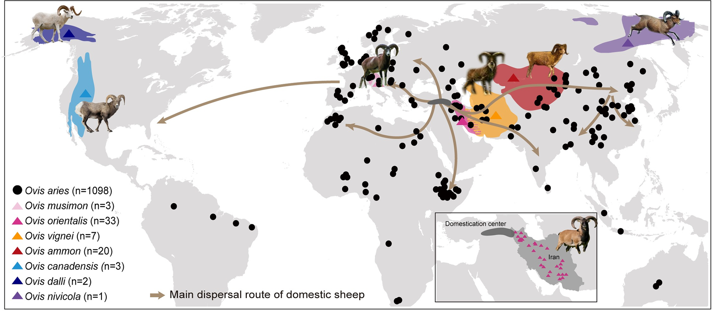
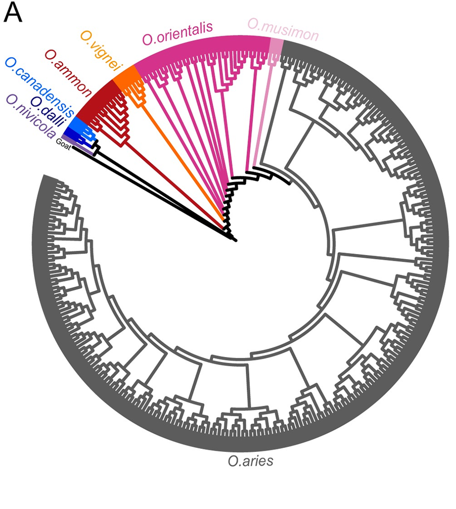
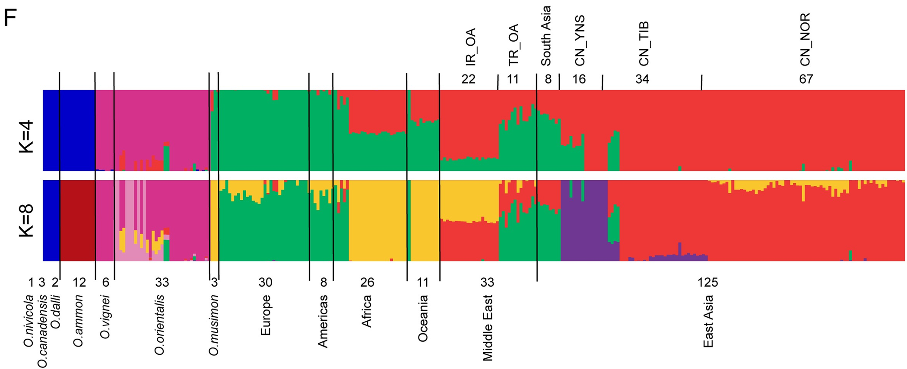
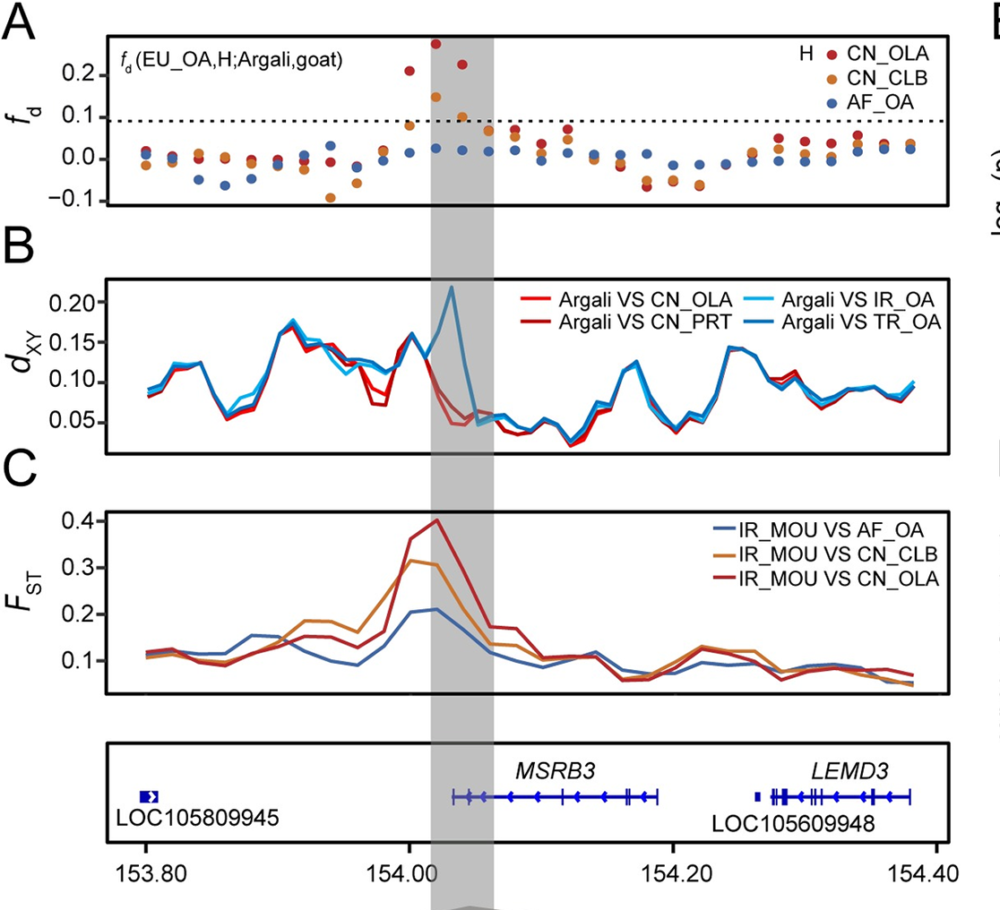
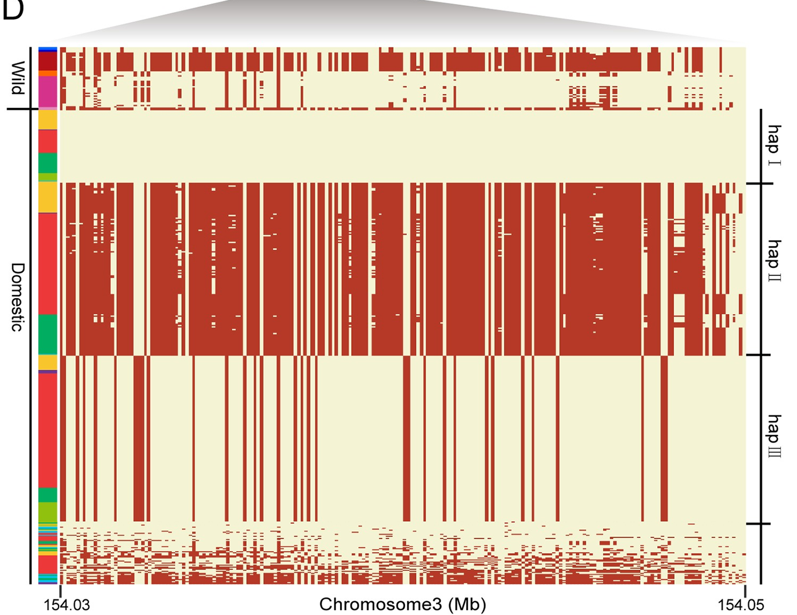

Each group is expected to submit a written report of about 2–3 pages in Word format.

Please also include a short statement on the contributions of each group member.

# Theory

This week, we are learning how hybridization and introgression can influence speciation and adaptation.

You saw that speciation is a continuum: populations gradually diverge, sometimes with gene flow still happening.

Hybridization is not always “noise”. Gene flow between species can provide useful genetic variation. This variation can then be used by natural/artifitial selection to help organisms adapt to new environments.

We also saw examples such as islands of differentiation (genomic regions with high differentiation) and the role of chromosomal inversions in protecting adaptive variant combinations from recombination.

# Genomic analysis of domestic sheep and wild relatives.

The paper we look at today is a very concrete example of this process.
https://doi.org/10.1371/journal.pgen.1010615

Researchers sequenced more than 1,000 domestic sheep and several wild relatives.

They discovered that some long haplotypes (genomic regions) in domestic sheep actually come from wild species such as *argali* and *mouflon*.

These introgressed haplotypes are not random: some of them are strongly associated with visible traits in sheep.

{width=80%}

Locations of different geographically wild *Ovis* species and diverse domestic sheep populations used in this study.

The colored blocks show the geographic distributions of the wild species. And each black dot represents a domestic breed. The dark grey block means the domestication center of sheep, and the solid lines represent dispersal routes of domestic sheep out of their domestication area.

**Q1**. Based on the map of wild sheep distributions and estimated dispersal routes of domestic sheep, where is the likely domestication center of Ovis aries?

**Q2**. Do the data suggest that sheep domestication occurred once (a single origin) or in parallel in multiple regions? 

{width=40%}

This is a maximum likelihood (ML) phylogenetic tree of 293 representative samples covering all species of Ovis genus with Goat (GCA_000317765.2) as an outgroup. The tree was built with a total of 332,990 loci. 

**Q3**. Which wild sheep species is genetically closest to domestic sheep (*O. aries*)?

Search and describe its similarity to the domestic sheep, and differences from the domestic sheep.

{width=80%}
The figure shows the results of a clustering analysis (often done with programs like STRUCTURE or ADMIXTURE).

Each vertical bar represents one individual sheep. The bar is divided into colored segments, where each color corresponds to a genetic cluster (ancestry component).

The proportion of each color within a bar indicates the proportion of that individual’s genome assigned to that ancestry.

In this type of analysis, K = number of clusters (ancestral populations) we ask the algorithm to assume.

At K=4, the model tries to explain all genetic variation using only four groups. This produces broad categories of ancestry — large continental or species-level clusters. Many populations get lumped together, so the colors look simple and coarse.

At K=8, the model uses more clusters, so it can capture finer differences between populations. New colors appear, and some populations that looked the same at K=4 now split into distinct components.

This doesn’t mean that one result is “true” and the other “false.” Rather, they show different levels of resolution:

Low K (K=4): big picture structure.

High K (K=8): detailed substructure and admixture

AF_OA, AM_OA, AU_OA, CN_OA, SA_OA, EU_OA, IR_OA, TR_OA, separately represent
domestic sheep from Africa, America, Oceania, China, south Asia, Europe, Iran and Turkey. 

CN_TIB, CN_YNS, CN_NOR for domestic sheep from Tibet,
Yunnan, Northern China. 

**Q4** 

At K=4, which ancestral clusters do Iranian (IR_OA) and Turkish (TR_OA) domestic sheep share most of their ancestry with, and in what proportions?

At K=8, how does the ancestry pattern of Iranian vs. Turkish sheep change?

{width=80%}

This figure combines results from several genomic analyses to show that a genomic region around the MSRB3 gene was introgressed from argali (wild sheep) into domestic sheep (Oar_v4.0 chr3: 153,800,001–154,380,001).

**Q5** 

fd is a statistic used to detect introgression. It quantifies whether one population shares more alleles with a potential donor species than expected under a simple tree. Higher values indicate stronger evidence of introgression.

From the distribution of fd in Fig. 5A, what does the signal around the MSRB3 region suggest?

**Q6** 

dXY measures the absolute sequence divergence between two populations. If introgression occurs, the recipient population will show reduced dXY to the donor species.

Question: How do the dXY values between argali and domestic sheep support introgression at MSRB3?

**Q7** 

FST reflects the degree of genetic differentiation between populations. A high FST peak indicates strong differentiation, often due to local adaptation or selection.

Question: What does the elevated FST around the MSRB3 locus imply about the evolutionary forces acting on this region?

{width=80%}

Haplotype pattern in the potential introgressed region (chr3: 154,030,048–154,062,195) of MSRB3 gene.

Each row = a phased haplotype from one individual.
Imagine we separate each individual’s chromosomes into the actual DNA sequences they carry. Each line in the figure represents one such sequence (a haplotype).

Each column = a SNP (single nucleotide polymorphism).
Each vertical slice shows one DNA position that can vary between individuals.

Colors (light yellow vs. red):

Light yellow = the same DNA base as in the reference genome (a kind of “standard” sequence used for comparison).

Red = an alternative DNA base (a mutation or variant compared to the reference).

Blocks of many SNPs in the same state (all yellow, all red, or a consistent mix) represent haplotypes that can be traced back to a common ancestor. One of these (Hap-II) matches argali, which shows it was introgressed into domestic sheep.

**Q8**  Why does Hap-II stand out compared to the other haplotypes, and what does its pattern (rows and colors) tell us about the history of this DNA region in domestic sheep?

**Q9**  Search the literature to identify what traits MSRB3 is linked to in sheep or other mammals.

**Q10** 

- Discuss why an introgressed MSRB3 haplotype might have spread in domestic sheep populations.

- Propose a simple experimental plan (a few sentences are enough) to test the role of MSRB3 in shaping ear morphology or other traits.