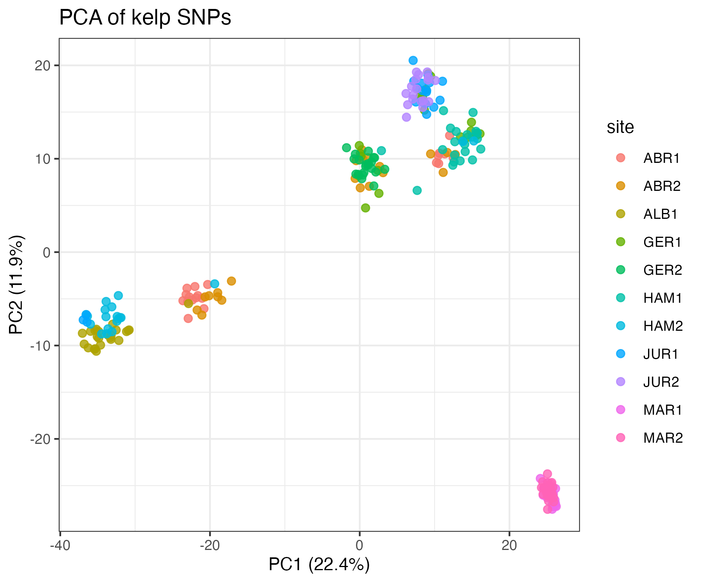
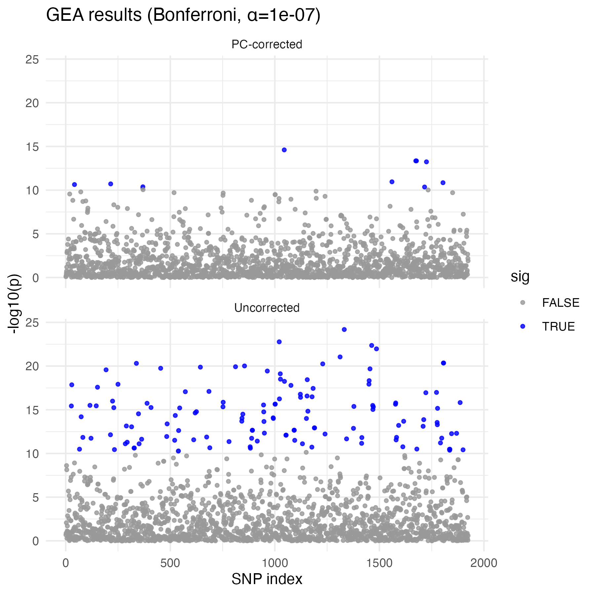
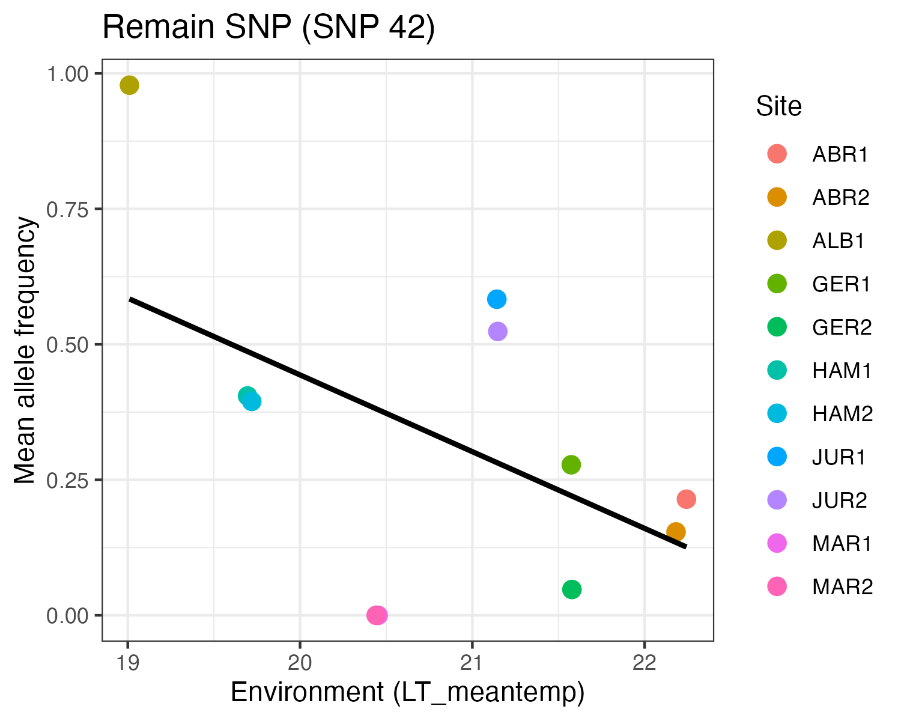
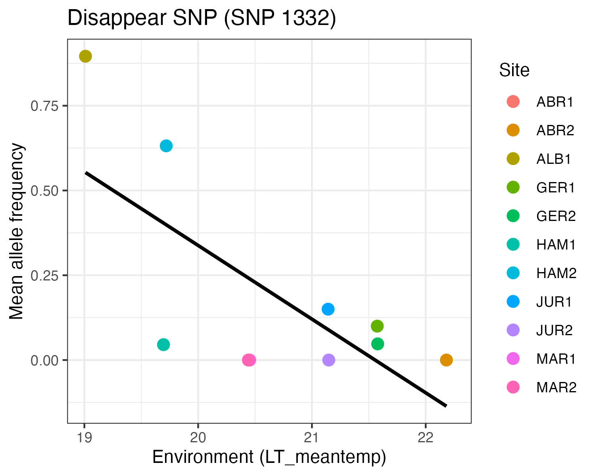

---
title: "BIO322_2025 Weekly assignment 1.3"
output: html_document
---


Each group is expected to submit a written report of about 2–3 pages in Word format.

Please also include a short statement on the contributions of each group member.


# Theory

We use data from this paper this week.

[Genotype–Environment mismatch of kelp forests under climate change](https://onlinelibrary.wiley.com/doi/10.1111/mec.15993)

Kelp forests are essential ecosystems but are threatened by climate change.

Using over 4000 SNPs, researchers studied kelp along the Western Australian coast and found strong population structure and genetic signals linked to temperature and light.

The results suggest that future warming may cause a mismatch between current genotypes and future environments, highlighting the need for proactive management such as assisted adaptation.


# Instruction for students

If you feel ambitious, you are welcome to run the R scripts yourself to explore the dataset.

We will use the dataset provided here:
https://zenodo.org/records/4826421

**latgrad_geno** (genotype data)
**latgrad_pop_env.csv** (environmental data)


However, if you are unsure or if time is limited during class, please don’t worry. You can still complete the assignment by using the figures provided here.


The exercises are designed so that you can answer the questions without running the code yourself. 
If you would like extra support with the technical side, you are encouraged to use external help resources.


<details>
<summary>**R script**</summary>

```{r,eval=FALSE}
# ------------------------------
# Load SNP genotype data
# ------------------------------
geno_lines <- readLines("latgrad_geno")   # file without header, space separated
length(geno_lines)                        # expected: 4245 SNPs

# Convert to numeric matrix
geno_matrix <- do.call(rbind, strsplit(geno_lines, split=""))
geno_matrix <- apply(geno_matrix, 2, as.integer)
geno <- t(geno_matrix)   # individuals × SNPs

# Replace missing (9) with NA
geno[geno == 9] <- NA

# ------------------------------
# Load environmental data
# ------------------------------
env <- read.csv("latgrad_pop_env.csv")
stopifnot(nrow(geno) == nrow(env))

# ------------------------------
# Minor allele frequency filter
# ------------------------------
idx_by_site <- split(seq_len(nrow(geno)), env$site)
n_site      <- length(idx_by_site)
half_thresh <- ceiling(n_site / 2)

count_sites_maf_ok <- function(g, idx_list, maf_cut = 0.01){
  cnt <- 0L
  for (ii in idx_list){
    gi <- g[ii]
    gi <- gi[!is.na(gi)]
    if (length(gi) == 0L) next
    p   <- mean(gi) / 2
    maf <- min(p, 1 - p)
    if (!is.na(maf) && maf >= maf_cut) cnt <- cnt + 1L
  }
  cnt
}

keep_by_half <- vapply(
  seq_len(ncol(geno)),
  function(j) count_sites_maf_ok(geno[, j], idx_by_site) >= half_thresh,
  logical(1)
)

geno <- geno[, keep_by_half, drop = FALSE]

# ------------------------------
# PCA of genotypes
# ------------------------------
geno_imp <- geno
for(j in 1:ncol(geno_imp)){
  m <- mean(geno_imp[,j], na.rm=TRUE)
  geno_imp[is.na(geno_imp[,j]), j] <- m
}
X <- scale(geno_imp, center=TRUE, scale=TRUE)
pc <- prcomp(X, center=FALSE, scale.=FALSE)

pcs <- pc$x[,1:5]

# % variance explained
var_exp <- round(100 * summary(pc)$importance[2, 1:2], 1)

# Plot PCA
library(ggplot2)
pc_df <- data.frame(PC1=pcs[,1], PC2=pcs[,2], site=env$site)

p_pca <- ggplot(pc_df, aes(x=PC1, y=PC2, color=site)) +
  geom_point(size=2, alpha=0.8) +
  theme_bw() +
  labs(
    title="PCA of kelp SNPs",
    x=paste0("PC1 (", var_exp[1], "%)"),
    y=paste0("PC2 (", var_exp[2], "%)")
  )

ggsave("PCA_kelp.png", p_pca, width=6, height=5, dpi=300)

# ------------------------------
# Association tests
# ------------------------------
get_pvals <- function(env_var, pcs=NULL){
  apply(geno, 2, function(g){
    if (all(is.na(g))) return(NA)
    if (is.null(pcs)){
      fit <- lm(g ~ env_var)
    } else {
      fit <- lm(g ~ env_var + pcs)
    }
    coef(summary(fit))[2,4]
  })
}

# Example: mean temperature
env_var <- env$LT_meantemp

# Without PC correction
p1 <- get_pvals(env_var, pcs=NULL)
q1 <- p.adjust(p1, method="fdr")

# With PC correction (PC1, PC2)
p2 <- get_pvals(env_var, pcs=pcs[,1:2])
q2 <- p.adjust(p2, method="fdr")

# ------------------------------
# Manhattan-like plot
# ------------------------------
library(dplyr)

alpha <- 1e-7
bonf  <- alpha / ncol(geno)

df_all <- bind_rows(
  data.frame(SNP=1:ncol(geno), logp=-log10(p1),
             sig=p1<bonf, Condition="Uncorrected"),
  data.frame(SNP=1:ncol(geno), logp=-log10(p2),
             sig=p2<bonf, Condition="PC-corrected")
)

p_manh <- ggplot(df_all, aes(x=SNP, y=logp, color=sig)) +
  geom_point(size=1, alpha=0.8) +
  scale_color_manual(values=c("grey60","blue")) +
  facet_wrap(~Condition, ncol=1) +
  theme_minimal() +
  labs(x="SNP index", y="-log10(p)",
       title=paste0("GEA results (Bonferroni, α=",alpha,")"))

ggsave("GEA_results.png", p_manh, width=6, height=6, dpi=300)

# ------------------------------
# Identify disappearing and remaining SNPs
# ------------------------------
sig_uncorrected <- which(p1 < bonf)
sig_corrected   <- which(p2 < bonf)

disappear <- setdiff(sig_uncorrected, sig_corrected)
remain    <- (sig_corrected)

# strongest examples
snp_disappear <- disappear[which.min(p1[disappear])]
snp_remain    <- remain[which.min(p1[remain])]

cat("Disappear SNP:", snp_disappear, "p=", p1[snp_disappear], "\n")
cat("Remain SNP   :", snp_remain,    "p=", p1[snp_remain], "\n")

# ------------------------------
# Plot allele frequency vs environment
# ------------------------------
make_plot_data <- function(snp_idx, env_var, env_name){
  g <- geno[, snp_idx]
  df <- data.frame(
    Genotype   = g, 
    AlleleFreq = g / 2,              # 0, 0.5, 1 per individual
    Env        = env_var,
    Site       = env$site
  )
  df
}


df_dis <- make_plot_data(snp_disappear, env$LT_meantemp, "LT_meantemp")
df_rem <- make_plot_data(snp_remain,    env$LT_meantemp, "LT_meantemp")

plot_snp <- function(df, snp_idx, label){
  df_mean <- df %>%
    group_by(Site) %>%
    summarise(
      mean_env  = mean(Env),
      mean_freq = mean(AlleleFreq, na.rm=TRUE),
      .groups="drop"
    )
  
  ggplot(df_mean, aes(x=mean_env, y=mean_freq, color=Site)) +
    geom_point(size=3) +
    geom_smooth(method="lm", se=FALSE, color="black") +
    theme_bw() +
    labs(
      title=paste0(label, " (SNP ", snp_idx, ")"),
      x="Environment (LT_meantemp)",
      y="Mean allele frequency"
    )
}

p_dis <- plot_snp(df_dis, snp_disappear, "Disappear SNP")
p_rem <- plot_snp(df_rem, snp_remain, "Remain SNP")

ggsave("Disappear_SNP.png", p_dis, width=5, height=4, dpi=300)
ggsave("Remain_SNP.png", p_rem, width=5, height=4, dpi=300)
```

</details>


**Q1.** What is the significance of conducting genotype–environment association (GEA) analysis on kelp populations?

**Q2.** Why is population structure a confounding factor (A variable that creates a false impression of association between two variables) in GEA analysis?
Hint: Imagine allele frequency differences driven by demographic history, not environment.


**Q3.**
In PCA (Principal Component Analysis), what does it mean biologically if two populations cluster together in a PCA of genotypes?

PCA: A dimensionality-reduction method that summarizes variation in high-dimensional data (like SNP genotypes) into a few axes (principal components).


**Q4.** 
How do you interpret the PCA results of kelp genotypes?

{width=60%}


**Q5.** 
Compare the Manhattan plots (Uncorrected vs PC-corrected). Why are there so many significant SNPs without correction?


Uncorrected: Association test between each SNP and the environment variable only.

Pros: Simple, sensitive to true signals.
Cons: Inflated false positives due to population structure.

PC-corrected: Association test that includes PCs (e.g., PC1 and PC2) as covariates.

Pros: Adjusts for genetic structure, reduces spurious associations.
Cons: May lose some power if over-corrected.


{width=80%}


X-axis: SNP index (or genomic position).
Y-axis: −log10(p-value). Higher values mean stronger evidence of association.
Threshold line: Often Bonferroni or FDR corrected. SNPs above the threshold are considered significant.


**Q6.**  Compare the maximum –log10(p) values between corrected and uncorrected analyses. What does this tell you about the strength of association signals before and after correction?


**Q7.** 
Compare the scatter plots of “Remain SNP (SNP 42)” and “Disappear SNP (SNP 1332)”. What differences can you infer between SNPs that remain significant after population structure correction and those that disappear?


From the script:


Remain SNPs: Still significant after PC correction (e.g., SNP 42).
Disappear SNPs: Significant before correction but not after (e.g., SNP 1332).

Meaning:

Remain SNP: The association persists even after accounting for structure, suggesting a robust signal of local adaptation.
Disappear SNP: The association vanishes after correction, indicating the original signal was due to confounding by population structure.


{width=50%} {width=50%}


**Q8.**  What risks exist if we were to interpret all uncorrected significant SNPs as evidence of adaptation?

**Q9.** Both SNPs show a negative regression slope between allele frequency and mean temperature. What does this slope indicate biologically?

**Q10.** How could you extend this analysis to test whether these SNPs are under selection?


**Q11 (optional)**

If you want, you can now explore two additional environmental variables:

**BO_damean = mean diffuse attenuation, representing light availability**

**BO2_curvelmean_bdmax = mean seawater velocity at depth**

For each variable, you will obtain Manhattan-style plots comparing uncorrected and PC-corrected results. 

By examining these, you can discuss:

whether significant SNPs are clustered or scattered,
how correction for population structure changes the signals,
and what these results might imply about adaptation to light versus current velocity.

<details> 
<summary>**R script**</summary>

```{r,eval=FALSE}
# ------------------------------
# Association tests for BO_damean and BO2_curvelmean_bdmax
# ------------------------------

env_vars <- c("BO_damean", "BO2_curvelmean_bdmax")

for (env_name in env_vars) {
  
  message("Running GEA for: ", env_name)
  
  env_var <- env[[env_name]]
  
  # Without PC correction
  p1 <- get_pvals(env_var, pcs=NULL)
  
  # With PC correction
  p2 <- get_pvals(env_var, pcs=pcs[,1:2])
  
  # Manhattan-like plot
  df_all <- bind_rows(
    data.frame(SNP=1:ncol(geno), logp=-log10(p1),
               sig=p1 < bonf, Condition="Uncorrected"),
    data.frame(SNP=1:ncol(geno), logp=-log10(p2),
               sig=p2 < bonf, Condition="PC-corrected")
  )
  
  p_manh <- ggplot(df_all, aes(x=SNP, y=logp, color=sig)) +
    geom_point(size=1, alpha=0.8) +
    scale_color_manual(values=c("grey60","blue")) +
    facet_wrap(~Condition, ncol=1) +
    theme_minimal() +
    labs(
      x="SNP index", 
      y="-log10(p)",
      title=paste0("GEA results for ", env_name,
                   " (Bonferroni, α=", alpha, ")")
    )
  
  ggsave(paste0("GEA_results_", env_name, ".pdf"),
         p_manh, width=6, height=6, dpi=300)
}

```

</details>