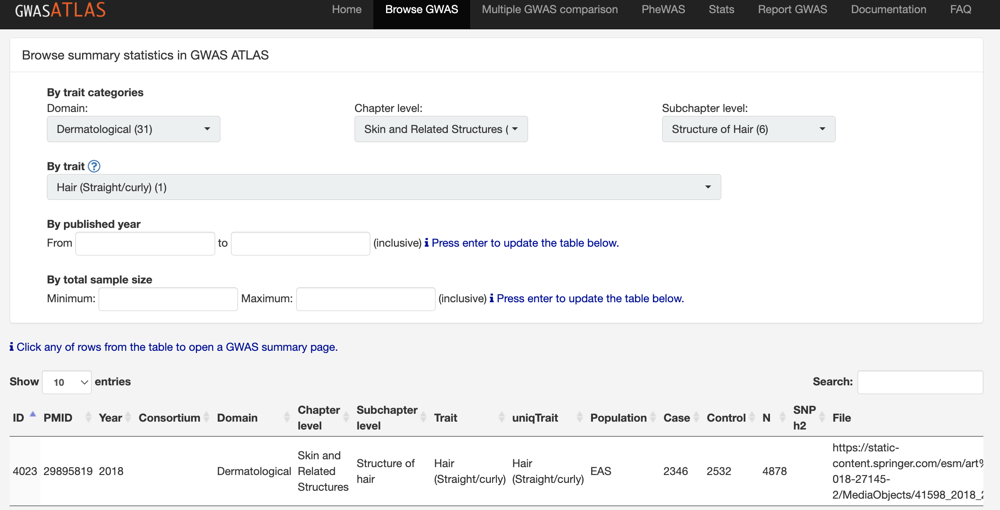
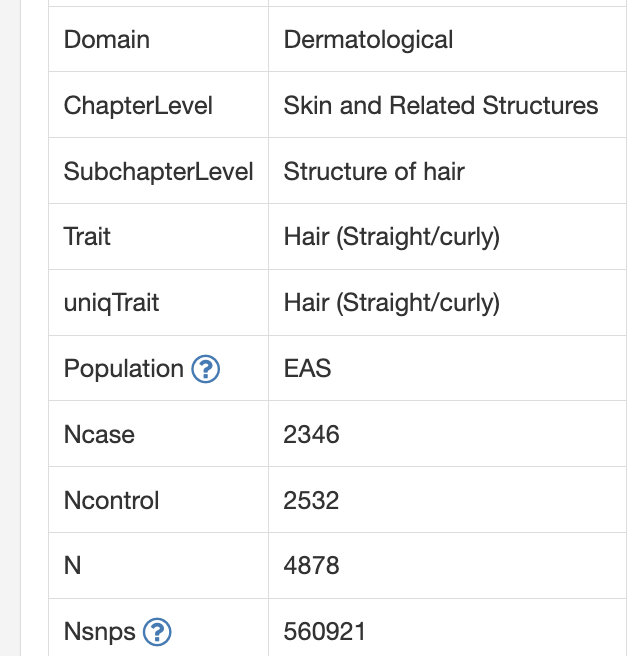
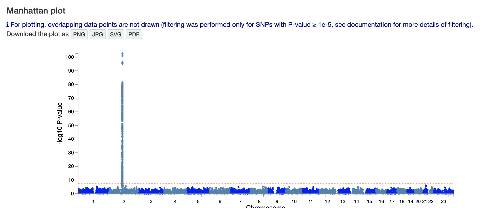
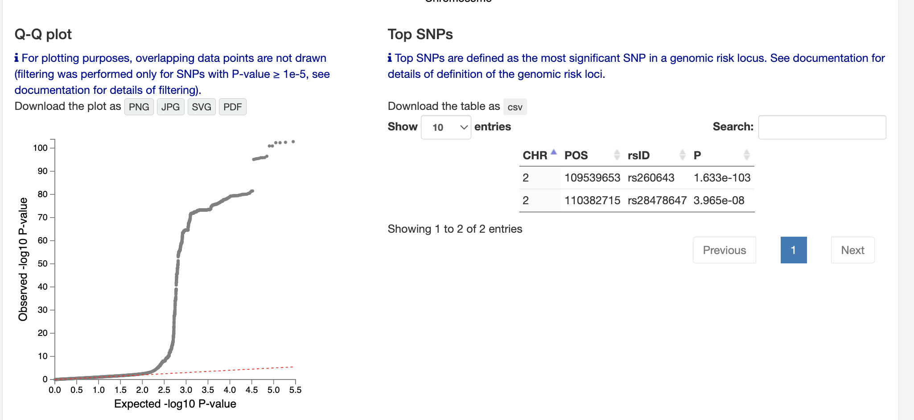
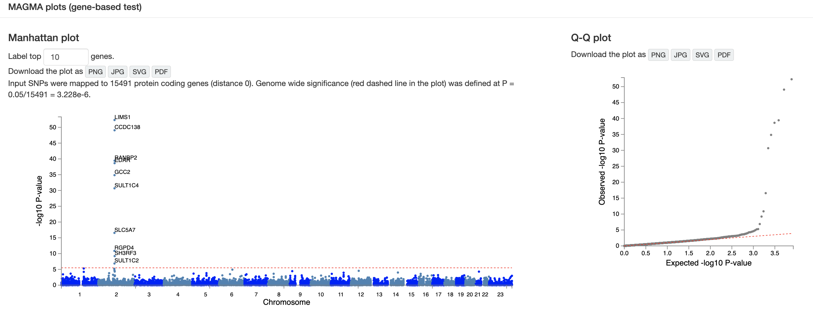
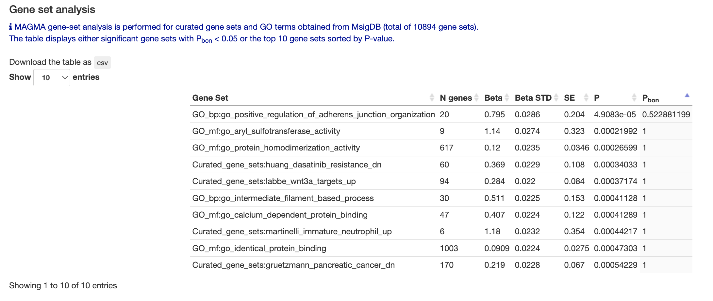
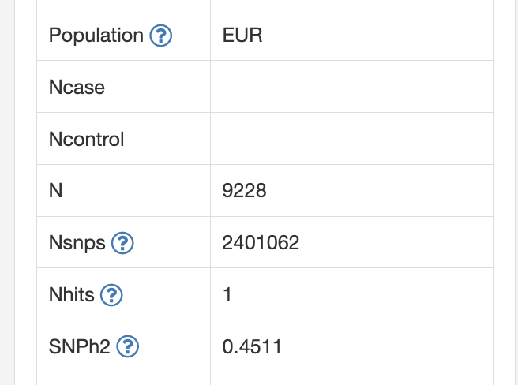
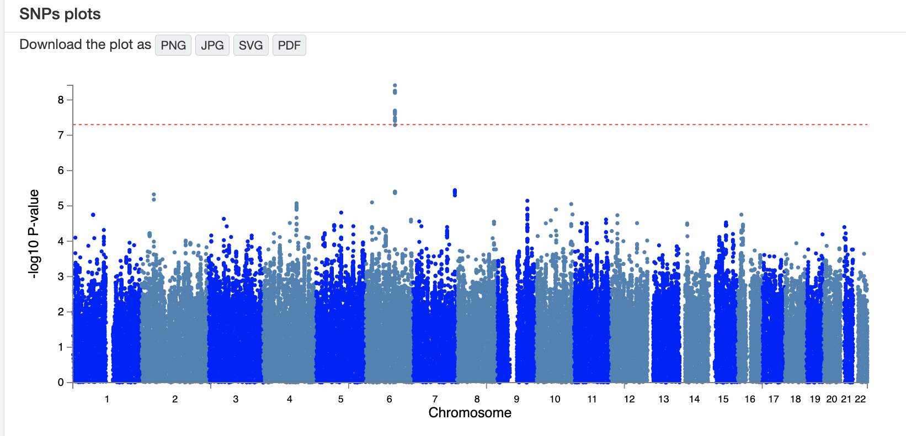
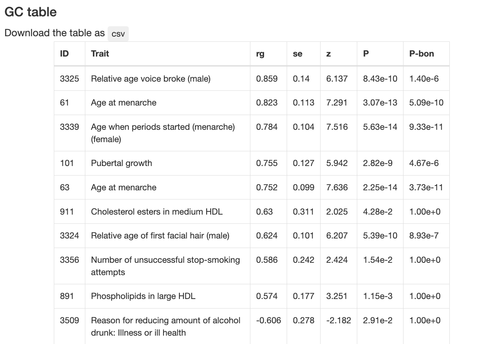

---
title: "BIO322_2025 Weekly assignment 2.2"
output: html_document
---

Each group is expected to submit a written report of about 2–3 pages in Word format.

Please also include a short statement on the contributions of each group member.

# Theory

**1. Study Design (GWAS basics)**

A Genome-Wide Association Study (GWAS) tests millions of SNPs across the genome to find associations with a trait.

Each SNP is tested independently: Does allele frequency differ between individuals with different phenotypes?

The challenge: GWAS does not prove causality; it highlights candidate regions for further study.

[GWAS Atlas](https://atlas.ctglab.nl/)

**Example**

Select "Browse GWAS" and Hair (Straight/Curly)

{width=90%}

{width=30%}

Trait / uniqTrait: Hair (Straight/curly)
→ The trait being studied is hair texture — whether it is straight or curly.

Population: EAS
→ The participants are from the East Asian population.

Ncase: 2,346
→ Number of individuals with one hair type (e.g., curly).

Ncontrol: 2,532
→ Number of individuals with the other hair type (e.g., straight).

N: 4,878
→ Total number of participants in the study.

Nsnps: 560,921
→ Number of genetic variants (SNPs) tested in this genome-wide association study.

**2. Manhattan Plot – how to read it**

{width=90%}

X-axis: chromosome position.

Y-axis: –log10(p-value). Higher = stronger evidence of association.

Each dot = one SNP tested.

Tall peaks = genomic regions with SNPs strongly associated with the trait.

**3. QQ Plot – what it shows**

{width=90%}

Q-Q plot = Quantile–Quantile plot comparing observed vs expected p-values.

X-axis: expected distribution under the null (no association).

Y-axis: observed values from the GWAS.

If points follow the diagonal → data looks like random noise (no signal).

If points rise above the line at the tail → excess of small p-values, evidence of real associations.

A strong upward curve = many SNPs truly associated (or confounding such as population stratification).

**4. MAGMA – gene-based test**

{width=90%}

MAGMA aggregates SNP-level results into gene-level statistics.

Helps interpretation by shifting focus from SNPs to biological units (genes, pathways).

Often followed by gene set analysis: enrichment of biological processes or GO terms.

**5. Gene Ontology Analysis - Associated the genes with known functions**

{width=90%}

**Let's see one more example**

Height

https://atlas.ctglab.nl/traitDB/104

{width=30%}

This GWAS analyzed 9,228 European individuals (EUR), testing about 2.4 million SNPs.

One SNP reached genome-wide significance.

The SNP-based heritability (SNP h² = 0.4511) means that about 45% of the variation in this trait can be explained by common genetic variants.

**6. Polygenic architecture – single gene vs many genes**

{width=90%}

Some traits (e.g., Mendelian diseases) are controlled by a single major gene.

Most human traits (height, hair shape, disease risk) are polygenic: influenced by thousands of variants of small effect.

GWAS typically finds many loci with small contributions, rather than one “major” gene.

Polygenicity explains why prediction requires polygenic risk scores rather than single SNPs.

**7. GC table（Genetic Correlation table)**

{width=60%}

This table shows genetic correlations (rg) between the studied trait and other traits.

A high positive rg (e.g., 0.86 for “Relative age voice broke (male)”) means that the two traits share many genetic influences.

Genetic correlation helps reveal shared biological pathways among traits.

Important: Correlation ≠ causation, but it helps identify pleiotropy or shared biology.

# Questions Overview

**Choose two traits from the GWAS Atlas.**

Answer the questions concisely, citing figures/tables from the report where appropriate. 2–3 pages plus annotated figures.

**Q1 Biological basis of the traits**

Assume the potential biological basis of the traits you selected,
from genomic variation, through molecular pathways, to the phenotype (possibly with environments.)

**Q2 Study Design Snapshot**

Task: In 3–4 sentences, summarize and compare the study design for your chosen traits.

**Q3 Reading the Manhattan Plot**

Task: Interpret andn compare the Manhattan plots.
Report the top locus/loci (chromosome or nearest gene label) or annotate the image.

**Q4 What the Q–Q Plot Tells You**

Task: Describe the Q–Q plot patterns. What does that imply?

**Q5 MAGMA: Gene-based Signal**

Task: Examine the MAGMA gene-based results.

List the top  genes (if available) and note whether they coincide with SNP-level peaks.

**Q6 Pick up one or two top genes**, and discuss how these genes are potentially involved in the molecular basis of the traits.

**Q7 Gene Set (Pathway/GO) Signals**

Report any significant gene sets/GO terms shown. 

Pick one enriched term and explain a biologically plausible link to the trait.

**Q8 Polygenic Architecture**

Argue whether the trait appears polygenic or associated with a single geneti signal

**Q9 Genetic Correlation (if available)**

If the report provides genetic correlations, pick one correlated trait. 

Interpret what shared genetic basis could mean here, and why correlation ≠ causation.

**10 From Association to Mechanism**

Propose some simple follow-up experiments to investigate the underlying mechanism to connect genotype to traits that you selected.
